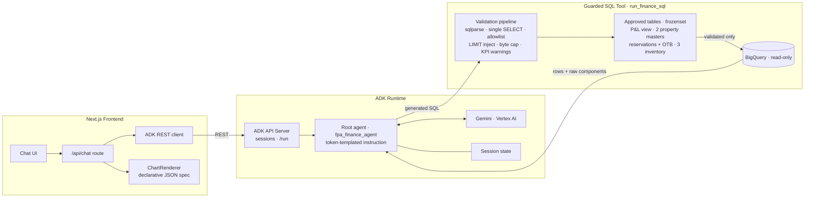
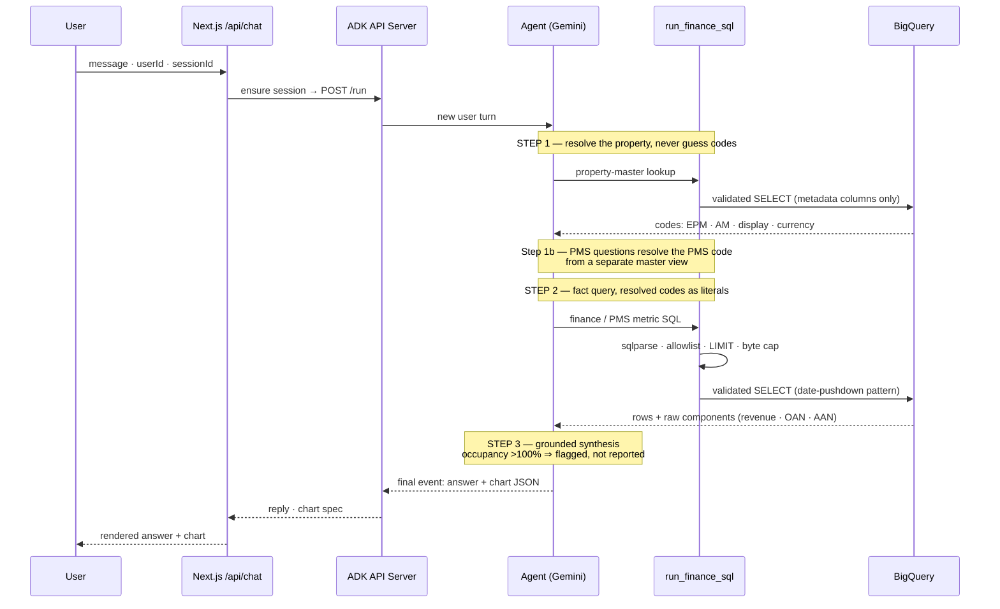
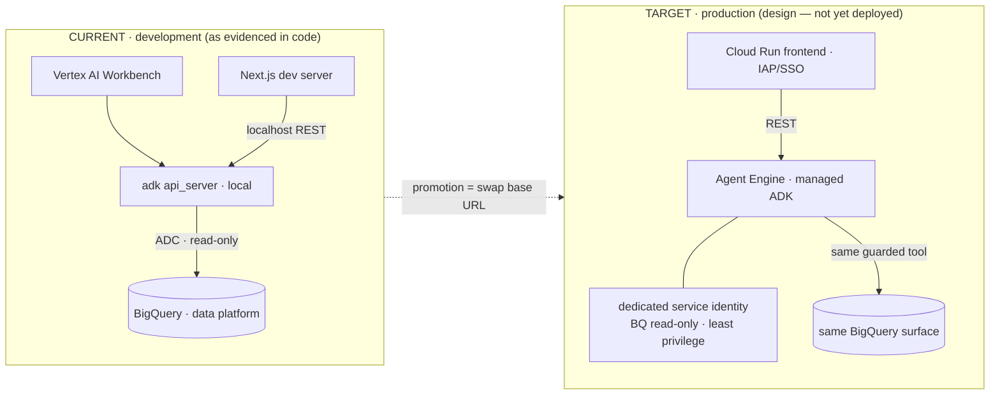

# Agentic FP&A Analytics — Google ADK Agent Blueprint

[](#)
[](#)
[](#)
[](#)
[](#)
[](#)

> **Portfolio** · [AI-infrastructure solutions-engineering hub](https://github.com/daetan999/technical_resume) · [value-engineering playbook — TCO / ROI](https://github.com/daetan999/technical_resume/blob/main/docs/value-engineering.md)
>
> **Infra-buyer's-eye value:** the LLM cost-governance and safety story every AI-infra buyer probes — a byte-billing cost cap, a frozen table allowlist, and single-SELECT parsing, so the agent can never run away with the warehouse bill or the data.

---

## Executive Summary

An LLM agent system on **Google's Agent Development Kit (ADK)** that lets finance and operations leaders at a multinational hospitality group ask natural-language questions — *"Compare ADR and RevPAR for Property Alpha, May, against budget, in local currency and group currency"* — and get **grounded, dual-currency answers with charts**, computed from governed BigQuery data.

The engineering thesis: **an analytics agent is only as trustworthy as the guardrails around its SQL.** Every number in every answer comes from deterministic SQL executed through a single guarded tool; the model reasons, plans, and narrates — it never does arithmetic and never touches the warehouse directly.

- **Marketing-mix-modeling P&L analytics + PMS operational metrics** (occupancy, ADR, RevPAR) unified behind one conversational surface.
- **Guarded SQL tool:** table allowlist as a `frozenset`, single-SELECT-only parsing, byte-billing cost cap, injected row limits, and KPI anti-summing warnings — validation the model cannot talk its way around.
- **A documented lessons-learned engineering log** (below) showing how each failure class — code-system mismatches, scan-limit blowups, duplicate-row inflation, silent source fallbacks — was converted into a structural safeguard.
- **Honest uncertainty:** an impossible computed result (occupancy > 100%) is presented as a flagged data-quality finding with raw components, never as an answer.

---

## Data Security & Scope Disclaimer

> **Architectural Blueprint Notice:** This repository serves strictly as a sanitized, open-source structural blueprint demonstrating [system design, data architecture, and workflow automation]. All proprietary enterprise API integrations, sensitive webhooks, internal routing logic, and production access tokens have been completely omitted or mocked for security and compliance.

All project IDs, dataset/table/column names, property names and codes, and every numeric figure in this repository are placeholders or fictional illustrations. The sample data is synthetic.

---

## Visual Architecture

### System Topology — Chat UI → ADK Runtime → Guarded SQL → BigQuery


<details>
<summary><strong>Diagram-as-code source (Mermaid)</strong></summary>



</details>

### Request Lifecycle — One Question, N Guarded Queries, One Grounded Answer


<details>
<summary><strong>Diagram-as-code source (Mermaid)</strong></summary>



</details>

### Deployment View — Current Development vs Target Production


<details>
<summary><strong>Diagram-as-code source (Mermaid)</strong></summary>



</details>

---

## Technology Stack

| Layer | Technology | Why it earns its place |
|---|---|---|
| Agent framework | **Google ADK** | Session management, the tool-calling loop, and a REST surface come free — the repo's code is almost entirely domain logic. |
| Model | **Gemini (Vertex AI)** | Env-driven model id means upgrades are a config change, not a redeploy. |
| Guarded execution | **`run_finance_sql` (single tool)** | One choke point for every query makes the security story auditable: no allowlisted table, no execution. |
| SQL analysis | **sqlparse** | Cheap structural parsing rejects multi-statement and non-SELECT input before anything reaches BigQuery. |
| Warehouse | **BigQuery** | The existing data platform's gold/silver views are the source of truth — the agent adds zero data copies. |
| Cost control | **`MAX_BYTES_BILLED`** | A hard per-query byte cap converts an expensive mistake into a refused query. |
| Frontend | **Next.js** | Server-side API route keeps the ADK endpoint private; the chart contract is declarative JSON rendered client-side. |

---

## The Guarded SQL Tool

Every query — including the agent's own metadata lookups — passes one validation pipeline:

1. **Parse:** `sqlparse` must yield exactly one statement, and it must be a `SELECT`.
2. **Allowlist:** every referenced table must be in the `APPROVED_TABLES` frozenset. Unknown table ⇒ structured rejection the model can read and correct.
3. **Lookup discipline:** property-master tables may be queried standalone for metadata resolution, restricted to an approved column set — the validator distinguishes "code lookup" from "fact query" shapes.
4. **Cost + volume:** `MAX_BYTES_BILLED` caps every execution; detail queries without a `LIMIT` get one injected.
5. **Semantics:** rate measures (ADR, RevPAR, Occ%) trigger anti-summing warnings attached to the tool result, keeping the model honest about aggregation.

## Two-Step Property Resolution

Property identity is the hardest problem in multi-source hospitality data: the EPM finance cube, the asset-management ledger, and the PMS each use **different code systems** for the same building, and the property master contains historical and alias codes that make naive JOINs explode row counts.

The agent is therefore forbidden from joining masters to facts. Instead:

- **Step 1:** standalone lookup against the property master → collect *all* known codes (EPM, AM, display name, currency).
- **Step 1b:** for PMS questions, resolve the PMS property code from a *separate* master view — it exists nowhere else.
- **Step 2:** inject the source-appropriate code into the fact query `WHERE` clause as a literal.

## Lessons-Learned Engineering Log

The repository's development history is preserved as a sanitized engineering log — each production failure became a structural safeguard. Figures are fictional illustrations of the real failure shapes.

| # | Failure observed | Root cause | Structural fix |
|---|---|---|---|
| 1 | Region grouping duplicated room counts and deflated ADR | JOINing the alias-rich property master to fact tables | Strict two-step querying; JOINs to facts rejected by the validator |
| 2 | Reservation query crashed the byte cap | `UNNEST` date explosion before filtering scanned full history | **Date-filter pushdown** before the `UNNEST`; cap kept as backstop |
| 3 | Confident "0 rows / data not available" | Finance-cube code used against PMS tables | Per-source code resolution (Step 1/1b above) |
| 4 | Same data double-counted | Mixing current + historical codes with `IN (...)` | Fact queries filter on exactly one source-appropriate code |
| 5 | ADR of 200 became "6,000" | `SUM()` over a rate measure | Additive vs non-additive measure semantics in config; `SAFE_DIVIDE` on raw components |
| 6 | Answers in one currency only | No dual-currency SQL example | Local + group-currency computed in one query, formatted together |
| 7 | PMS questions silently answered from finance data | Contradictory instruction rules + missing inventory tables | Availability tables added to the allowlist; contradiction removed; source stated in every answer |
| 8 | PMS queries returned zero rows for a valid property | The "PMS code" column didn't exist; a display-name column was mistaken for a code | Diagnostic-proven column map; phantom columns deleted from config |
| 9 | Occupancy computed at 187% | Duplicate reservation rows counted twice | `SELECT DISTINCT` before `UNNEST` (matches the reference reporting engine); raw components always returned |
| 10 | Occupancy still >100% for one property | Genuine nightly gaps in inventory coverage — under investigation | **Sanity gate:** impossible values are presented as flagged findings with raw components, never as answers |
| 11 | — (validation) | — | End-to-end pipeline proven on a second property: sane occupancy, clean per-night availability |

The full narrative, including dead ends and the diagnostic SQL patterns, lives in [`docs/lessons-learned.md`](docs/lessons-learned.md).

---

## Repository Map

```
app/agent.py          Root agent: token-templated instruction · tool wiring (illustrative)
app/bq_tool.py        The guarded SQL tool: validation pipeline skeleton
app/config.py         The contract: approved tables · measure semantics · fiscal calendar
frontend/             Next.js chat surface: /api/chat route · ADK client · ChartRenderer
data/                 Synthetic sample of the property-master shape (fictional rows)
docs/                 Lessons-learned log · SVG diagrams
```

All code here is **illustrative blueprint code**: interfaces, configuration shapes, and engineering conventions — no proprietary prompts, data, or credentials. Redacted internals raise `NotImplementedError("Blueprint stub — proprietary transformation omitted")`.

---

## Extensibility Roadmap

- **Agent Engine deployment** — the promotion path is a base-URL swap by design; the guarded tool is environment-independent.
- **Multi-agent decomposition** — a planner/executor split becomes attractive once query families grow; the single guarded tool remains the shared choke point.
- **Semantic-layer contract** — measure semantics (additive vs rate) already live in config; lifting them into a shared semantic layer would serve BI and the agent from one definition.
- **Evaluation harness** — the curated test-question set is the seed of a regression suite scoring groundedness and source-selection correctness per release.

---

## License

Released under the MIT License.
