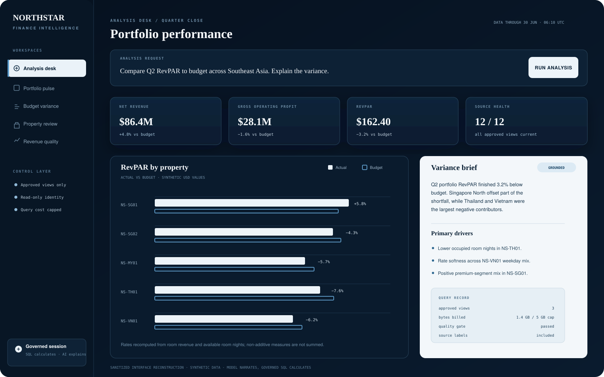
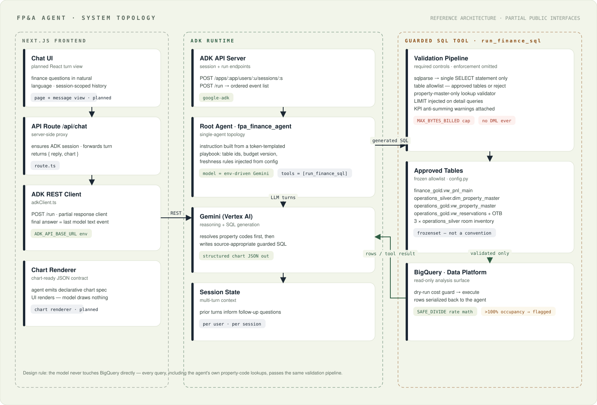
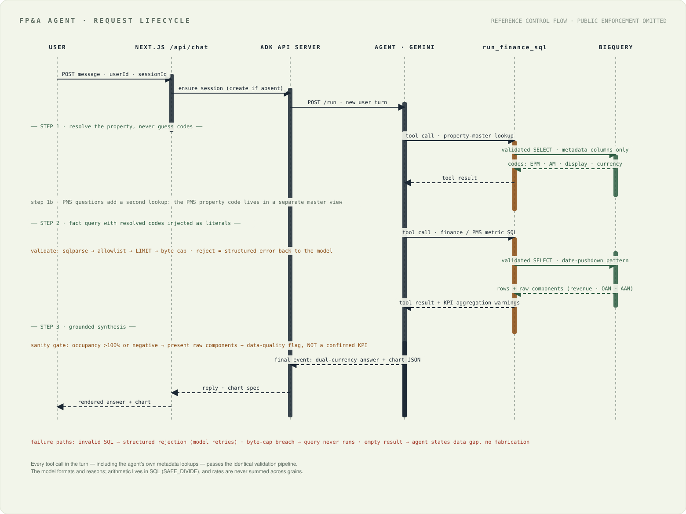
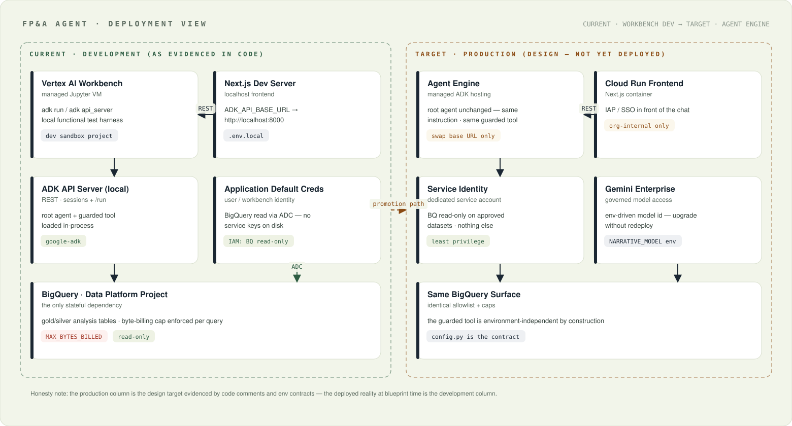

# Governed FP&A Analytics Agent

[](https://github.com/daetan999/adk-fpa-agent-blueprint/actions/workflows/ci.yml)
[](LICENSE)
[](requirements.txt)
[](app/config.py)
[](app/bq_tool.py)
[](frontend/src/lib/adkClient.ts)
[](app/bq_tool.py)
[](#project-brief)
[](data/sample_property_master.csv)
[](https://github.com/daetan999/technical_resume)

**Google ADK · Gemini on Vertex AI · BigQuery · Next.js**

[System topology](#system-design) · [Control contracts](app/config.py) · [Engineering log](docs/lessons-learned.md) · [Technical portfolio](https://github.com/daetan999/technical_resume)

A sanitized application blueprint for natural-language finance and operational analysis across P&L, budget variance, occupancy, ADR, RevPAR, and property performance.

The operating rule is deliberate: **the model plans and explains; governed SQL calculates.**



*Sanitized interface reconstruction using synthetic data. It illustrates the intended analysis experience and is not an internal screenshot.*

## Project brief

Recurring finance questions often require an analyst to locate the correct dataset, reconcile property identifiers, apply the right KPI definition, run a query, validate the result, and turn it into a decision-ready explanation.

This workflow combines those steps behind one controlled request path:

1. A user asks a finance or property-performance question in natural language.
2. The ADK agent selects an approved analysis path and resolves the relevant property identifiers.
3. One guarded tool validates the query, table access, cost ceiling, row volume, and KPI semantics.
4. BigQuery performs the calculations and returns raw KPI components with source context.
5. The model explains the result and emits a declarative chart specification for the interface.

The result is a faster analysis workflow without allowing the language model to become the source of financial truth.

## What I built

- A Google ADK agent and tool boundary for multi-turn finance analysis.
- A governed BigQuery access contract covering approved objects, lookup rules, fiscal calendars, additive and non-additive measures, and per-query cost limits.
- A two-step property-resolution pattern for finance, asset-management, and property-management identifiers.
- A Next.js-to-ADK request boundary with session-aware response and chart contracts.
- Data-quality handling that returns raw components and flags impossible ratios instead of presenting them as confirmed KPIs.
- A documented promotion path from a development topology to managed agent hosting and a Cloud Run frontend.

The professional workflow reduced common ad hoc extraction from hours to under two minutes. The public repository is a sanitized blueprint rather than the production implementation.

## System design



The topology separates the interface, ADK runtime, model, guarded execution path, and approved warehouse surface. Every warehouse request—including metadata lookups—must pass through the same tool boundary.

## Governed request lifecycle



The query path is designed around six controls:

- **Source selection:** choose finance or operational data according to the question.
- **Identifier resolution:** resolve the source-specific property code before querying facts.
- **Structural validation:** allow one read-only statement against approved objects.
- **Cost and volume control:** cap bytes billed and unrestricted result size.
- **KPI semantics:** calculate rates from raw components rather than summing stored percentages.
- **Quality response:** expose source gaps and impossible outputs instead of fabricating a clean answer.

## Why property resolution is separate

Finance, asset-management, and property-management systems can assign different identifiers to the same asset. Joining an alias-rich master directly to facts can duplicate rows; applying the wrong code can return a confident zero.

The agent therefore resolves the approved source identifier first, then queries the fact table with that identifier as a literal filter. This keeps code translation separate from financial aggregation.

## Development to production



The public design preserves the same application contract across both environments:

- **Development:** local Next.js interface, ADK API server, Application Default Credentials, and approved BigQuery views.
- **Target production:** Cloud Run frontend, managed ADK hosting, enterprise authentication, least-privilege service identity, and a central evaluation layer.

Environment configuration changes; query rules and KPI semantics do not.

## Engineering decisions shaped by failure

The control model came from concrete failure patterns: duplicate rows from alias joins, reservation expansion before date filtering, mismatched code systems, summed rates, silent source fallback, and impossible occupancy caused by duplicated stay records.

Each incident became an architecture rule, query constraint, or data-quality check. The full sanitized record is documented in the [engineering log](docs/lessons-learned.md).

## Public repository boundary

This repository contains the architecture, control contracts, representative interfaces, synthetic reference data, and partial application boundaries needed to review the design. It does not contain the production implementation.

- Project IDs, datasets, tables, columns, properties, codes, and numeric examples are placeholders or synthetic.
- Proprietary prompts, production query logic, credentials, internal endpoints, and company data are excluded.
- The guarded executor, authentication, complete client, deployment, and evaluation harness are not runnable from the public tree.
- Files marked as blueprint stubs define interface and control requirements; they are not presented as complete enforcement.
- `frontend/` publishes the two files that define the request boundary, not a buildable application. There is no `package.json`, `next.config`, or page tree, and `route.ts` depends on a Next.js install and the `@/lib/*` path alias, so the interface cannot be run or type-checked from the public tree.

## Repository map

```text
app/agent.py                         ADK root-agent interface
app/bq_tool.py                       Guarded SQL tool contract
app/config.py                        Approved data and KPI rules
frontend/src/app/api/chat/route.ts   Server-side request boundary
frontend/src/lib/adkClient.ts        Partial ADK session client (excerpt)
data/                                Synthetic property reference data
docs/assets/                         Interface and architecture visuals
docs/lessons-learned.md              Sanitized engineering log
```

## Verify the public artifact

```bash
python -m compileall app
python - <<'PY'
from pathlib import Path
import csv
import xml.etree.ElementTree as ET

rows = list(csv.DictReader(Path("data/sample_property_master.csv").open()))
assert rows and all(row["display_name"] for row in rows)
for diagram in Path("docs/assets").glob("*.svg"):
    ET.parse(diagram)
print("Published blueprint assets verified")
PY
```

These checks validate Python syntax, the synthetic fixture, and SVG structure. They do not validate BigQuery execution, ADK runtime behavior, authentication, deployment, or end-to-end guardrail enforcement.

## Technology

Google ADK · Gemini on Vertex AI · BigQuery · Next.js · Python · TypeScript · `sqlparse`

## License

Released under the [MIT License](LICENSE).

---

[Return to Dae Tan's AI Infrastructure Solutions Portfolio](https://github.com/daetan999/technical_resume)
